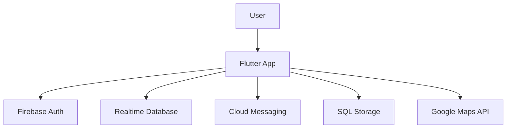

  

<h1 align="center">🚨 Road Helper</h1>

Your Roadside Emergency Companion – Built with ❤️ using Flutter & Firebase

  
  
  
  

---

## 📝 Overview

**Road Helper** is a mobile application that helps drivers manage road emergencies in real-time. From mechanical failures and accidents to fuel shortages or medical issues – the app connects drivers with nearby help and smart tools for immediate action.

> 🚗 Stay safe. Stay connected. Road Helper is your emergency assistant on the road.

---

## 🌟 Core Features

| 🚀 Feature | 🔍 Description |
|-----------|----------------|
| **🔔 SOS Alerts** | Send emergency messages with live GPS location |
| **🧠 AI Chatbot** | Get smart assistance based on your emergency situation |
| **📍 Real-Time Location** | Integrated Google Maps for nearby services |
| **🤝 Help Requests** | Connect with nearby users to get or provide help |
| **🪪 License Verification** | Upload driver’s license during sign-up to ensure authenticity |
| **⚙️ Customization** | Profile editing, theme & language options |

---

## 🧰 Tech Stack

| Layer       | Tools & Services                         |
|-------------|-------------------------------------------|
| Frontend    | `Flutter SDK`, `Dart`                    |
| Backend     | `Firebase`, `Node.js`                    |
| APIs        | `Google Maps`, `Geolocation`             |
| Notifications | `Firebase Cloud Messaging (FCM)`       |
| Storage     | `Firebase Storage`, `SQL` (Driver Images) |

---

## 🧠 System Architecture

---

## 🚧 Future Enhancements

- 🔗 Integration with Egyptian Traffic Authority API
- 📡 Offline Mode for help requests
- 🧭 Global user help-request network
- 🟢 WhatsApp fallback for emergency messaging

---

## 👨‍👩‍👧‍👦 Team

| Name                | Role               |
|---------------------|--------------------|
| Mario Ibrahem Nassef | Team Leader |
| Mario Mina Gaballa   | Member |
| Abanoub Yousry Helmy | Member |
| Maria Fadl Naguib    | Member |
| Shahd Wael Fathy     | Member |
| Rana Abdelrahman     | Member |
| Aesha Mohamed Saad   | Member |

---

## 📁 Resources

- 🎥 Demo Video: *Coming Soon*
- 🎨 Figma Design: *Coming Soon*
- 🖼️ Screenshots: *Coming Soon*
- 📊 Presentation Slides: *Coming Soon*

---

## 📜 License

This project is licensed under the [MIT License](LICENSE).

---

<i>Developed with 💙 for safer roads</i>

